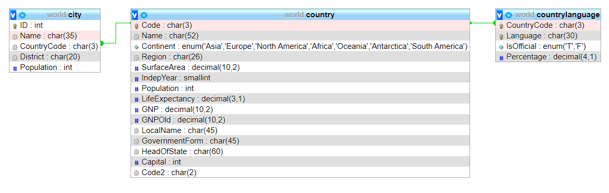

# SQL
## Projektion

````sql
SELECT
       e.id AS id,
       e.pupil_id AS pupilId,
       e.school_subject_id AS schoolSubjectId,
       e.exam_number AS examNumber,
       e.points AS points,
       school_subject.label AS schoolSubject
FROM exam e
    INNER JOIN school_subject
        ON (e.school_subject_id = school_subject.id)
WHERE
      e.pupil_id = ?
ORDER BY
        examNumber ASC
````



Die obige SQL-Abfrage benennt die selektierten Spalten so um, dass sie zu folgender
Klasse passen:

````php
public class Exam extends Entity {

    public String schoolSubject;

    protected int id;
    protected Integer pupilId;
    protected Integer schoolSubjectId;
    protected Integer examNumber;
    protected Integer points;
````